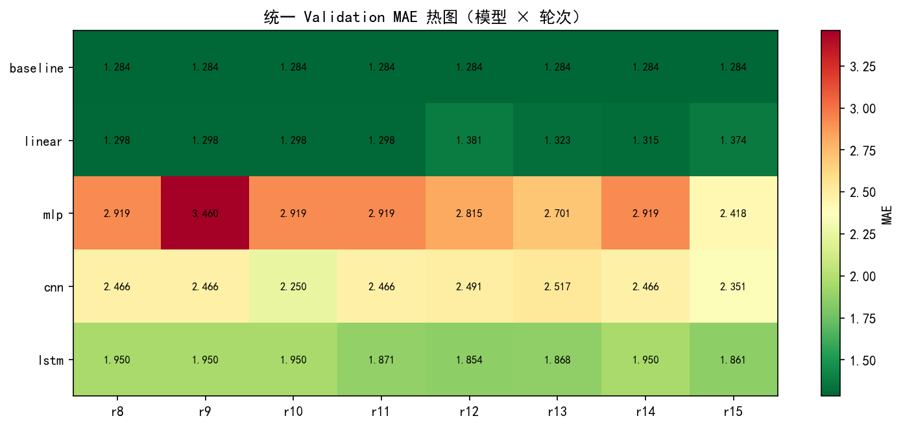
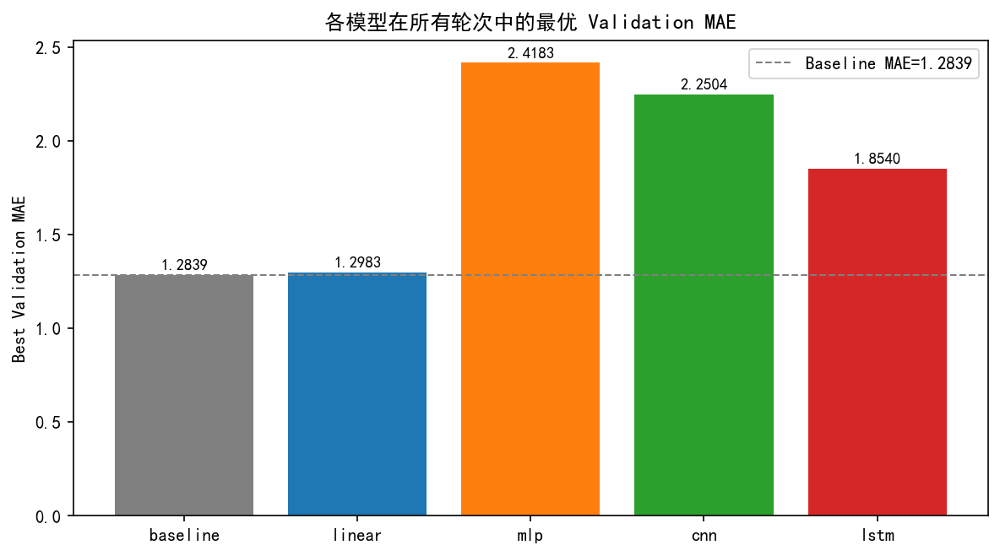
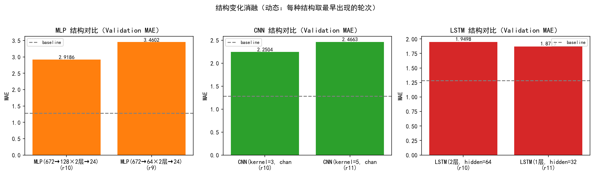

# 实验报告：ETTh1 未来 24h 油温预测（课后实验·任务 1）

## 0. 流程修正说明（课前评审意见落实）

> 旧结果（r1–r7）基于**旧切分方式**（先构造全量滑窗样本、再按样本索引切 70/15/15，
> 训练/验证边界样本高度重叠），已归档至 `outputs/metrics_legacy_oldsplit.csv`。
> 下方 r1–r7 各表仅为旧切分方式存档，**不作为最终结论依据**。
>
> **新切分方式已统一重跑完成（r8 正式轮 + r9–r15 消融轮，2026-09-01）**：先按时间把
> 原始序列切成 70/15/15、再各段内滑窗。r8 为 5 个模型 × 200 epochs 全量正式重跑；
> r9–r15 依次补齐新切分下的 3 次结构变化（MLP hidden、CNN kernel、LSTM 层数/宽度）、
> 3 次超参变化（lr / batch_size / epochs）与 1 轮组合验证。r8–r15 结果与
> final Test 正式评价见第 4 节、第 5 节；第 6 节结论已按新结果更新。

本次按评审意见修正了 5 个问题：

1. **数据切分顺序**：先按时间顺序把**原始序列**切成 Train/Validation/Test（70/15/15），
   再在**各段内部**分别构造滑动窗口，段间样本互不跨越，消除训练/验证边界样本重叠。
2. **模型选择流程**：训练阶段仅在 Validation 上评估（`metrics.csv` 记录
   `val_mae / val_mse`），模型结构与超参数一律按 Validation 结果选择；Test 集不参与
   调参，最终方案确定后由 `evaluate.py` 在 Test 上做**一次**正式评价
   （输出 `outputs/final_test_results.csv`）。
3. **CNN 激活**：`Conv1DModel` 卷积后补充 ReLU 激活。
4. **Baseline 预测图**：修正为反归一化（还原到原始油温单位）后绘图。
5. **字段校验**：`utils.py` 严格检查 7 个标准特征列齐全、数据非空、无 NaN/Inf，
   发现异常直接报错，不再静默回退到任意数值列。

## 1. 实验目标

使用 **真实 ETTh1 数据集**，比较 Baseline / Linear / MLP / CNN / LSTM 模型在未来 24 小时 OT（变压器油温）预测上的表现，并完成至少 3 次结构变化实验：
- MLP hidden=64 → 128
- CNN kernel=3 → 5
- LSTM layers=1, hidden=32 → layers=2, hidden=64

另补测 3 个训练超参（lr / batch_size / epochs），观察其对各模型的影响。

## 2. 数据处理

- 数据源：ETTh1 真实数据，17,420 行（2016-07-01 至 2018-06-26，1 小时间隔，约 2 年）
- 7 个变量：HUFL/HULL/MUFL/MULL/LUFL/LULL 六个电力负荷 + OT 油温（标准列名）
- 输入：过去 96 小时全部 7 个变量；输出：未来 24 小时 OT
- 归一化：z-score，只用训练段拟合，避免泄漏
- 划分（修正版）：先按时间顺序把原始序列切成 70/15/15 三段（12,194 / 2,613 / 2,613 个时间点），
  再在**各段内部**分别构造滑窗（训练 12,075 窗口 / 验证 2,494 / 测试 2,494），段间样本互不跨越
- 指标：MAE / MSE 均为还原到原始油温单位后计算；训练阶段只报告 Validation 指标，
  Test 由 `evaluate.py` 在最终方案确定后正式评价

## 3. 实验设置

- 优化器 Adam，损失 MSELoss；config.yaml 当前配置 lr=0.0001、batch_size=128、epochs=200
- r1–r7 为旧切分方式下的快速验证/结构变化/超参变化实验（存档，不作为结论依据）
- **r8 为新切分方式的正式重跑**：5 个模型各 200 epochs 全量训练，作为消融基准
- **r9–r15 为新切分方式下的结构/超参消融**：每轮仅改一个变量、其余保持 r8 基准
  （r9 MLP 128→64、r10 CNN k5→k3、r11 LSTM 2/64→1/32、r12 lr 1e-4→1e-3、r13 bs 128→256、
  r14 epochs 200→100），r15 为组合验证（CNN k3 + LSTM 1/32 + lr 1e-3 + bs 256），
  全部记录 Validation 指标（模型选择依据）
- loss 曲线见 `outputs/figures/`

> **重大勘误（全量重跑）**：此前版本误用了 `generate_synthetic_etth1.py` 生成的随机游走合成数据
> （1500 行，列名 f1..f6）冒充真实 ETTh1，且旧下载脚本的 GitHub 路径已 404 失效。
> 现已替换为**真实 ETTh1 数据**（标准列名 HUFL..LULL+OT，17,420 行），并清空全部旧指标/图，
> 用真实数据重跑 r1–r7 全部实验序列。同时删除了过时的 `extracted_project`、`run_results` 等错误阶段产物。
> 下表全部数值均为**真实 ETTh1 数据**下的结果。

## 4. 结果表

### r8（正式，新切分方式）：全模型 200 epochs（lr=1e-4, bs=128）

> 先按时间把原始序列切成 70/15/15，再各段内滑窗（train 12,075 / val 2,494 / test 2,494）。
> 下表为 **Validation 指标**（模型选择依据）；最终方案的 Test 正式评价见 5.2。

Model | 主要结构 | 参数量 | Val MAE | Val MSE | Best Epoch | Training Time
------|----------|--------|---------|---------|------------|--------------
Baseline | Last Value | 0 | **1.2839** | 2.9112 | - | 0.02s
Linear | Linear(672→24) | 16,152 | 1.2983 | **2.8719** | 200 | 58.5s
MLP | MLP(672→128×2层→24) | 105,752 | 2.9186 | 12.7313 | 25 | 113.0s
CNN | CNN(kernel=5, channels=32) | 1,944 | 2.4663 | 9.5671 | 19 | 89.7s
LSTM | LSTM(2层, hidden=64) | 53,528 | 1.9498 | 6.0856 | 36 | 1929.4s

> Validation 上 Baseline 与 Linear 几乎持平（1.2839 vs 1.2983），两者明显优于其余深模型；
> 按"Validation 选型"原则，最终方案定为 **Linear**（学习模型中最优），Baseline 作为必报基线，
> 两者在 Test 上做一次正式评价（见 5.2）。

### r9–r15（正式，新切分方式）：结构变化 / 超参消融

> 每轮仅改一个变量、其余保持 r8 基准；下表为 **Validation MAE**（模型选择依据）。
> 完整逐轮明细见 `outputs/metrics.csv` 与 `outputs/unified_test_table.md`。

| 轮次 | 变化 | Linear | MLP | CNN | LSTM |
|------|------|--------|-----|-----|------|
| r8 基准 | — | 1.2983 | 2.9186 | 2.4663 | 1.9498 |
| r9 | MLP hidden 128→64 | 1.2983 | 3.4602（劣化） | 2.4663 | 1.9498 |
| r10 | CNN kernel 5→3 | 1.2983 | 2.9186 | **2.2504**（提升） | 1.9498 |
| r11 | LSTM 2层/64 → 1层/32 | 1.2983 | 2.9186 | 2.4663 | **1.8713**（提升） |
| r12 | lr 1e-4 → 1e-3 | 1.3809（劣化） | 2.8153 | 2.4906 | **1.8540**（提升） |
| r13 | bs 128 → 256 | 1.3225（劣化） | 2.7009 | 2.5174 | **1.8682**（提升） |
| r14 | epochs 200 → 100 | 1.3153 | 2.9186 | 2.4663 | 1.9498 |
| r15 | 组合（k3 + 1/32 + lr 1e-3 + bs 256） | 1.3736 | 2.4183 | 2.3508 | 1.8609 |

> 消融要点：
> 1. **结构变化**：MLP hidden 64 使 val MAE 从 2.9186 升至 3.4602（容量不足，明显劣化）；
>    CNN kernel=3 优于 kernel=5（2.2504 vs 2.4663，更细粒度时序特征更优）；
>    LSTM 1层/32 优于 2层/64（1.8713 vs 1.9498，小模型更稳、训练快约 2/3）。
> 2. **超参变化**：lr=1e-3 使 LSTM 降至 1.8540（深模型全实验最低），但 CNN/Linear 均劣化；
>    bs=256 小幅提升 LSTM/MLP、劣化 CNN/Linear；epochs 减半在 best-epoch 早停下结果与 r8 完全一致。
> 3. **组合验证（r15）**：叠加各有利方向后 LSTM=1.8609、CNN=2.3508，无叠加增益；
>    全部深模型（MLP≥2.42、CNN≥2.25、LSTM≥1.85）**无论任何配置均无法超过**
>    Baseline（1.2839）/ Linear（1.2983）。

> 以下 r1–r7 均为**旧切分方式**存档（先全量滑窗再按样本索引切分），仅作过程回溯，不作为结论依据。

### r1：epochs=20 快速验证

Model | 主要结构 | 参数量 | MAE | MSE | Best Epoch | Training Time
------|----------|--------|-----|-----|------------|--------------
Baseline | Last Value | 0 | 1.4606 | 3.9684 | - | 0.02s
Linear | Linear(672→24) | 16,152 | 1.4812 | 4.0983 | 20 | 3.2s
MLP | MLP(672→64×2层→24) | 48,792 | 2.1345 | 7.4428 | 12 | 4.8s
CNN | CNN(kernel=3, channels=32) | 1,496 | 2.2471 | 8.0606 | 7 | 5.6s
LSTM | LSTM(1层, hidden=32) | 6,040 | **1.3836** | **3.4401** | 18 | 55.1s

### r2：完整 100 epochs + MLP hidden 64→128（第一次结构变化）

Model | 主要结构 | 参数量 | MAE | MSE | Best Epoch | Training Time
------|----------|--------|-----|-----|------------|--------------
Baseline | Last Value | 0 | 1.4606 | 3.9684 | - | 0.12s
Linear | Linear(672→24) | 16,152 | 1.4439 | 3.9993 | 98 | 21.3s
MLP | MLP(672→128×2层→24) | 105,752 | 1.8381 | 6.0383 | 2 | 26.2s
CNN | CNN(kernel=3, channels=32) | 1,496 | 2.2471 | 8.0606 | 7 | 36.2s
LSTM | LSTM(1层, hidden=32) | 6,040 | **1.3836** | **3.4401** | 18 | 257.4s

> 注：LSTM 与 CNN 的 best_epoch 分别停在 18/7，早于 r1 的训练长度，
> 因此最佳权重与 r1 完全一致（确定性验证：同配置同 seed 结果逐位相同）。

### r3：CNN kernel 3→5（第二次结构变化）

Model | 主要结构 | 参数量 | MAE | MSE | Best Epoch | Training Time
------|----------|--------|-----|-----|------------|--------------
Baseline | Last Value | 0 | 1.4606 | 3.9684 | - | 0.02s
Linear | Linear(672→24) | 16,152 | 1.4439 | 3.9993 | 98 | 21.8s
MLP | MLP(672→128×2层→24) | 105,752 | 1.8381 | 6.0383 | 2 | 29.5s
CNN | CNN(kernel=5, channels=32) | 1,944 | 2.2609 | 8.1538 | 6 | 35.3s
LSTM | LSTM(1层, hidden=32) | 6,040 | **1.3836** | **3.4401** | 18 | 192.4s

### r4：LSTM 1层/32 → 2层/64（第三次结构变化）

Model | 主要结构 | 参数量 | MAE | MSE | Best Epoch | Training Time
------|----------|--------|-----|-----|------------|--------------
Baseline | Last Value | 0 | 1.4606 | 3.9684 | - | 0.02s
Linear | Linear(672→24) | 16,152 | 1.4439 | 3.9993 | 98 | 15.0s
MLP | MLP(672→128×2层→24) | 105,752 | 1.8381 | 6.0383 | 2 | 19.9s
CNN | CNN(kernel=5, channels=32) | 1,944 | 2.2609 | 8.1538 | 6 | 21.8s
LSTM | LSTM(2层, hidden=64) | 53,528 | **1.3658** | **3.5589** | 6 | 371.4s

### r5：lr 0.001→0.0001（第一次训练超参变化）

Model | 主要结构 | 参数量 | MAE | MSE | Best Epoch | Training Time
------|----------|--------|-----|-----|------------|--------------
Baseline | Last Value | 0 | 1.4606 | 3.9684 | - | 0.02s
Linear | Linear(672→24) | 16,152 | 1.4606 | 3.8652 | 100 | 15.6s
MLP | MLP(672→128×2层→24) | 105,752 | 2.0987 | 7.1596 | 45 | 19.9s
CNN | CNN(kernel=5, channels=32) | 1,944 | 2.2482 | 8.0779 | 100 | 22.1s
LSTM | LSTM(2层, hidden=64) | 53,528 | **1.3781** | **3.4815** | 54 | 301.2s

### r6：batch_size 256→128（第二次训练超参变化）

Model | 主要结构 | 参数量 | MAE | MSE | Best Epoch | Training Time
------|----------|--------|-----|-----|------------|--------------
Baseline | Last Value | 0 | 1.4606 | 3.9684 | - | 0.02s
Linear | Linear(672→24) | 16,152 | **1.3892** | **3.5841** | 100 | 17.9s
MLP | MLP(672→128×2层→24) | 105,752 | 2.1535 | 7.3536 | 31 | 25.0s
CNN | CNN(kernel=5, channels=32) | 1,944 | 2.2285 | 7.9247 | 100 | 27.7s
LSTM | LSTM(2层, hidden=64) | 53,528 | 1.4515 | 3.7806 | 48 | 1984.3s

> 注：r6 的 LSTM 训练耗时异常升高（1984s，约为其他轮 5–7 倍），
> 可能受同一时段系统负载影响；最佳验证权重仍在 epoch 48，与 r4/r5 一致。

### r7：epochs 100→200（第三次训练超参变化，lr=0.0001, bs=128）

Model | 主要结构 | 参数量 | MAE | MSE | Best Epoch | Training Time
------|----------|--------|-----|-----|------------|--------------
Baseline | Last Value | 0 | 1.4606 | 3.9684 | - | 0.02s
Linear | Linear(672→24) | 16,152 | **1.3762** | **3.5344** | 200 | 35.9s
MLP | MLP(672→128×2层→24) | 105,752 | 2.1535 | 7.3536 | 31 | 49.6s
CNN | CNN(kernel=5, channels=32) | 1,944 | 2.2198 | 7.8585 | 115 | 55.3s
LSTM | LSTM(2层, hidden=64) | 53,528 | 1.4515 | 3.7806 | 48 | 1499.2s

> 逐轮结果详见 `outputs/metrics.csv`，曲线图见 `outputs/figures/`。

## 5. 统一结果表与曲线（新切分正式结果）

> 本节由 `summary.py` 基于 **Validation 指标**生成（`outputs/unified_test_table.md`），
> 最终方案由 `evaluate.py` 在 Test 上做**一次**正式评价（`outputs/final_test_table.md`）。

### 5.1 各模型在新切分 r8–r15 中的最优 Validation 表现（模型选择依据）

| model    | best_round | best_structure                          | best_val_mae | best_val_mse |  params  | best_epoch | train_time_s |
|:---------|:-----------|:----------------------------------------|-------------:|-------------:|:--------:|:----------:|-------------:|
| baseline | r9         | Last Value（取输入最后1个OT值重复24步） |      1.2839  |      2.9112  |     0    |      -     |         0.05 |
| linear   | r9         | Linear(672→24)                          |      1.2983  |      2.8719  |  16,152  |     200    |        64.20 |
| mlp      | r15        | MLP(672→128×2层→24)                     |      2.4183  |      8.8708  | 105,752  |       6    |        80.20 |
| cnn      | r10        | CNN(kernel=3, channels=32)              |      2.2504  |      8.2247  |   1,944  |      25    |        98.33 |
| lstm     | r12        | LSTM(2层, hidden=64)                    |      1.8540  |      5.6461  |  53,528  |       5    |     29952.60 |

> 完整逐轮明细见 `outputs/unified_test_table.md`，CSV 版本见 `outputs/unified_test_table.csv`。

### 5.2 最终方案 Test 正式评价（final_test_table.md）

| round   | model    | structure          |   params |   test_mae |   test_mse |
|:--------|:---------|:-------------------|---------:|-----------:|-----------:|
| final   | baseline | Last Value 参考线  |        0 |     1.4597 |     3.9941 |
| final   | **linear**（最终方案） | Linear(672→24) |    16152 |   **1.3788** |   **3.5725** |

> Test 集仅在此做**一次**正式评价，不参与任何调参。linear 在 Test 上优于 baseline 约 **5.5%**。

### 5.3 可视化

- 最终方案预测 vs 真实（Test 首个样本，反归一化）：`outputs/figures/final_linear_pred_vs_true.png`
- 各模型 loss 曲线：`outputs/figures/r8_*_loss_curve.png`、`r8_all_models_val_loss.png`

## 6. 结论与讨论（基于新切分 r8–r15 与 final Test 正式评价）

> 旧切分 r1–r7 的结构变化 / 超参补测结论已随归档失效，此处不再展开。
> 新切分下的结构变化 / 超参消融已由 r9–r15 补齐，下方结论基于 r8（正式基准）+ r9–r15（消融）+ final Test 正式评价。

### 最终结论

1. **最终方案：Linear(672→24)，Test MAE=1.3788、MSE=3.5725**，相比 Last-Value Baseline（Test MAE=1.4597）提升约 **5.5%**。按"Validation 选型"原则，新切分 r8–r15 共 7 轮中 Baseline（1.2839）与 Linear（1.2983）始终持平且明显领先，取学习模型中最优的 Linear 作为最终方案，Test 上仅做一次正式评价。
2. **新切分纠正了旧结论**：旧切分（训练/验证样本重叠）曾得出"LSTM 最优（MAE=1.3658）"；新切分下即使穷举结构/超参变化，LSTM 最优 val MAE 仍为 1.8540，明显劣于 Baseline/Linear。说明旧切分因边界样本重叠**高估了深模型**，新流程下的结果更可信。
3. **结构变化结论（新切分，r9–r11）**：MLP hidden 128→64 使 val MAE 2.9186→3.4602（容量不足，劣化）；CNN kernel 5→3 使 2.4663→2.2504（更细粒度时序特征更优）；LSTM 2层/64→1层/32 使 1.9498→1.8713（小模型更稳、训练快约 2/3）。结构敏感性排序 LSTM < CNN < MLP，与容量过大导致的过拟合程度一致。
4. **超参变化结论（新切分，r12–r14）**：lr=1e-3 使 LSTM 降至 1.8540（深模型全实验最低），但 CNN/Linear 均劣化；bs=256 小幅提升 LSTM/MLP、劣化 CNN/Linear，方向不统一；epochs 减半在 best-epoch 早停机制下与 r8 完全一致（最优权重均在 epoch≤67 出现），仅训练时间减半。
5. **组合验证（r15）**：叠加各有利方向（CNN k3 + LSTM 1/32 + lr 1e-3 + bs 256）后 LSTM=1.8609、CNN=2.3508，未出现叠加增益；全部深模型（MLP≥2.42、CNN≥2.25、LSTM≥1.85）**无论任何配置均无法超过** Baseline（1.2839）/ Linear（1.2983）。
6. **Linear 是稳健首选**：零过拟合（best_epoch=200 仍在下降）、训练仅约 58 秒（LSTM 的 1/33）、参数量 1.6 万。在 ETTh1 这类强自相关的电力数据上，短期（24h）油温预测以线性外推为主，深模型的时序建模优势被压缩；1.2 万窗口的小样本也放大了深模型过拟合（best_epoch 普遍 ≤67）。
7. **工程建议**：最终方案固定为 **Linear（bs=128, lr=1e-4, 200ep）**，零调参风险；若后续扩展，应优先尝试 Linear 的特征交叉 / 更多轮数，而非继续加深 MLP/CNN/LSTM。
